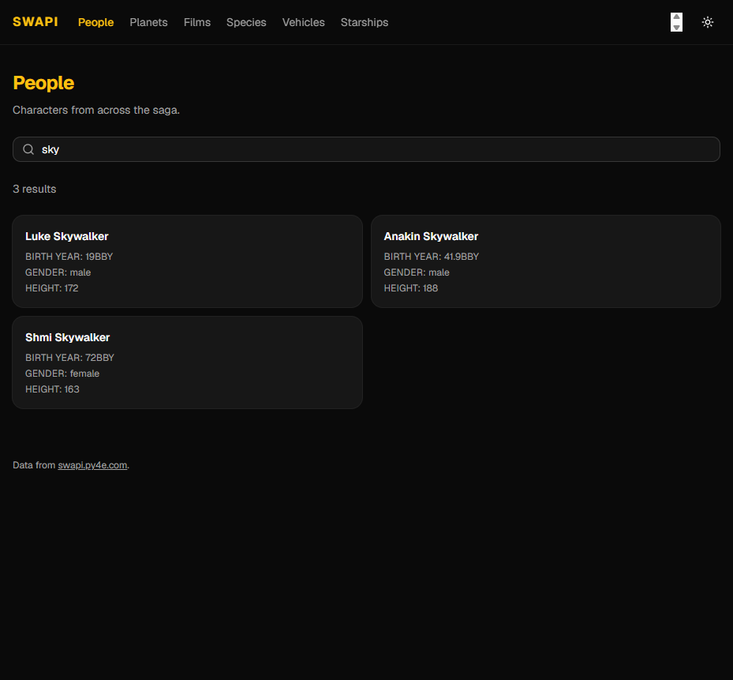
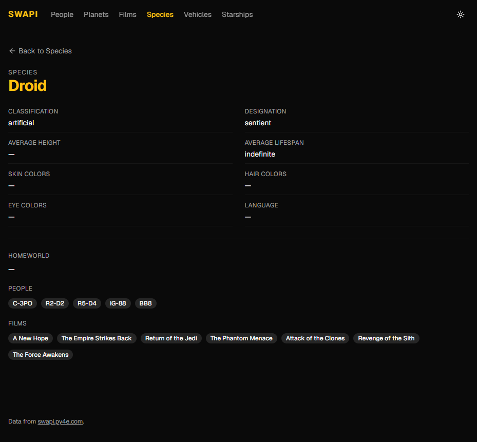

# SWAPI Explorer

[](https://github.com/AymenSakouhi/star-wars-explorer/actions/workflows/ci.yml)

A small React app for browsing the Star Wars API — all six resources, with search, pagination, and relations resolved into links, so you can follow a character to their homeworld and on to the films it appears in.

Built as a take-home assignment for JAKALA.



## Running it

```bash
npm install
npm run dev
```

No configuration needed — the API base URL has a working default. To point it elsewhere, copy `.env.example` to `.env` and edit `VITE_SWAPI_BASE_URL`.

| Script                  | What it does                   |
| ----------------------- | ------------------------------ |
| `npm run dev`           | Dev server                     |
| `npm run build`         | Typecheck and production build |
| `npm run preview`       | Serve the production build     |
| `npm test`              | Run the test suite once        |
| `npm run test:watch`    | Watch mode                     |
| `npm run test:coverage` | Suite plus a coverage report   |
| `npm run lint`          | oxlint                         |
| `npm run typecheck`     | `tsc --noEmit`                 |
| `npm run format`        | Prettier, in place             |

**Stack:** Vite 8 · React 19 · TypeScript 6 · Tailwind CSS 4 · shadcn/ui · TanStack Query 5 · React Router 7 · Zod 4 · Vitest · Testing Library · MSW.

## How it is put together

### One registry, two pages

SWAPI's six resources share an envelope, a query interface, and an identity scheme. They differ only in field names. The obvious build is six list pages and six detail pages; this one is a single typed registry plus two generic route components.

```ts
// src/lib/swapi/resources.ts
people: defineResource<Person>({
  label: 'People',
  schema: personSchema,
  title: (person) => person.name,
  listFields: ['birth_year', 'gender', 'height'],
  detailFields: ['height', 'mass', 'hair_color' /* … */],
  relations: ['homeworld', 'films', 'species', 'vehicles', 'starships'],
  searchHint: 'Search people by name',
})
```

`defineResource<T>` pins the entity type per entry, so every field name is checked against that resource's inferred shape. Writing `'gendr'` in `listFields` fails to compile — with a _did you mean `gender`?_ suggestion — rather than quietly rendering a blank cell. Adding a seventh resource is one config object and zero new components.

### Validation at the boundary

`swapiFetch` parses every response through its Zod schema before returning it. This is the one place runtime validation earns its cost: the app talks to a third-party API it does not control, and an unannounced shape change should become a _named, visible_ error rather than `undefined` propagating three layers down into a render crash.

`SwapiError` discriminates `network | http | parse` and exposes `isRetryable`. A parse failure is never retried, because the same request returns the same bad payload; a 404 is equally settled. The UI reads that flag and simply doesn't render a retry button where retrying provably cannot help — offering one that does nothing only teaches users to distrust it.

### State lives where it belongs

There is no client state store, deliberately:

| State                | Lives in                 | Why                                        |
| -------------------- | ------------------------ | ------------------------------------------ |
| Server data          | TanStack Query cache     | It is a cache, not state                   |
| Search term, page    | URL search params        | Shareable, restorable, back-button-correct |
| Theme                | `localStorage` + context | Genuinely client state, genuinely global   |
| In-flight keystrokes | Local `useState`         | Transient, debounced into the URL          |

`/people?q=sky&page=2` pasted into a fresh tab lands exactly where it points. The search input debounces before committing, so the history gains one entry per search rather than one per keystroke, and the back button steps between searches.

### Caching

SWAPI's dataset is immutable — the films shipped decades ago — so `staleTime` is `Infinity`. Revisiting a list refetches nothing.

More usefully, `byUrlQuery` (which resolves relation URLs) shares cache keys with `detailQuery`. Five characters who share a homeworld fetch that planet once between them, and a planet already loaded from the planets list costs nothing when a character links to it. That is the deduplication a hand-rolled store would otherwise need, and there is a test asserting the shared key because the whole design rests on it.

Pagination uses `keepPreviousData` so page changes don't replace good content with a skeleton, and detail routes prefetch on hover or focus.

### Every async state, once

A single `QueryBoundary` renders loading, error, empty, and success, and every screen goes through it — so no screen can handle three of the four and leave the user staring at a blank page on the fourth.



## Testing

140 tests. Vitest, Testing Library, and MSW; ~93% statement coverage.

MSW serves fixtures trimmed from **real** `swapi.py4e.com` responses, so the schemas are tested against the shape the API actually returns rather than an idealised one. Unhandled requests fail the run, so no test can silently reach the network and pass slowly in CI.

Tests assert on user-visible behaviour through accessible queries (`getByRole`, `getByLabelText`) rather than on test-ids or internals. Failure cases are covered as first-class: a 500, a 404, a malformed payload, and a partially-broken relation each have a test.

CI runs format, lint, typecheck, test with coverage, and build on every push and pull request.

## Assumptions and decisions

The brief asked for these to be recorded, so here they are in full.

1. **`swapi.dev` was down.** Verified on 2026-08-05 — the connection failed outright, not a 4xx or 5xx. The brief permits either host, so the app targets `swapi.py4e.com`. The base URL is env-configurable, so a reviewer can repoint it at `swapi.dev` if it returns, without touching code.

2. **SWAPI exposes no IDs.** Identity exists only inside the `url` string. Parsing it is a tested helper (`idFromUrl`) rather than an inline regex, because every route depends on it.

3. **SWAPI exposes no images.** The UI is text-first. Sourcing character art would mean third-party assets with unclear licensing — not something to do casually in a take-home.

4. **Numeric-looking fields are strings.** SWAPI sends `height`, `population`, and `cost_in_credits` as strings, substituting the sentinels `"unknown"` and `"n/a"`. Coercing them to numbers in the schema would either throw on real data or silently produce `NaN`, so they stay strings and formatting is presentation's job.

5. **Sentinels render as an em dash**, not as the literal word "unknown". But `"indefinite"` — a droid's average lifespan — is _not_ treated as a sentinel: it is a real answer, and blanking it would lose information.

6. **`species.homeworld` is the only nullable field** across all six resources. Found by reading actual payloads rather than assuming uniformity.

7. **`?search=` matches different fields per resource** (name, title, model). Surfaced through per-resource placeholder copy instead of a generic "Search".

8. **`strict` was missing from the Vite template's tsconfig** and is enabled explicitly. `create-vite@9` also ships oxlint rather than ESLint, which is what `npm run lint` runs.

### Cut on purpose

- **Internationalisation.** Not asked for; English strings are inline.
- **Virtualisation.** SWAPI's page size is fixed at 10. Virtualising would be complexity with no user-visible payoff.
- **A backend or SSR.** A static SPA is the right shape for a public read-only API.
- **Exhaustive field coverage.** The registry selects the fields worth showing; screens stay readable.
- **End-to-end tests.** The integration tests cover the same journeys against MSW. Playwright was used interactively to verify against the live API — which caught three real defects the unit tests could not — but adding it to CI wasn't worth the setup time here.

### What I would do next

- Playwright smoke tests in CI, against a recorded fixture set.
- Error-boundary coverage — the render-crash path is currently the one branch with no test.
- Prefetch each resource's first page from the home hub, the way detail routes already prefetch on hover.
- Client-side sorting. SWAPI offers no `ordering` parameter, so it would have to be per-page and should say so in the UI rather than pretend to sort the whole set.

## Design notes

The brief asked for minimal design effort, so the entire visual identity is one accent colour token over shadcn's neutral defaults, in light and dark, both meeting WCAG AA against their own background. No custom illustration and no asset pipeline.

Accessibility was kept cheap and present: landmarks, a skip link, one `h1` per page, a labelled search input, an `aria-live` result count, and cards that are real anchors so keyboard navigation and focus order come for free.

## Project layout

```
src/
  lib/swapi/     client, schemas, registry, queries, URL helpers
  lib/format.ts  sentinel and label formatting
  components/    QueryBoundary, search, pagination, cards, relations
  features/      the two generic route components
  app/           providers, router, layout, theme
  pages/         home, 404
  test/          MSW handlers, fixtures, render helper
docs/
  specs/         the design agreed before implementation
  plans/         the task-by-task implementation plan
```

`docs/specs/` and `docs/plans/` are the design and plan written before any code, kept in the repo because they show the reasoning, not just the result.
